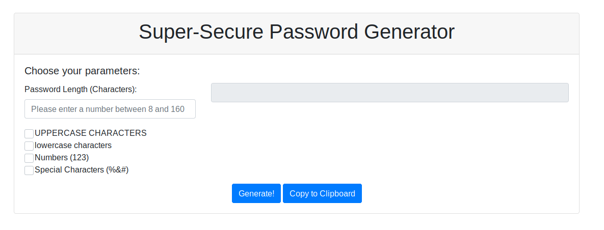

# week-3-homework
A random password generator

It's best practice to use a different password for each website/application you log into, rather than using the same password for everything. That password should be unique and hard to guess. This application takes the user's preferences for password length, and whether they would like to use uppercase, lowercase, numbers, or special characters, or a combination of the four. 

## how to use this application

download the repository and run "index.html" in your browser. Fill in the requested parameters, and press the "Generate!" button. If you want a new password, just press the button again. You can copy the generated password to your clipboard by pressing the "copy to clipboard" button.

## screenshot

